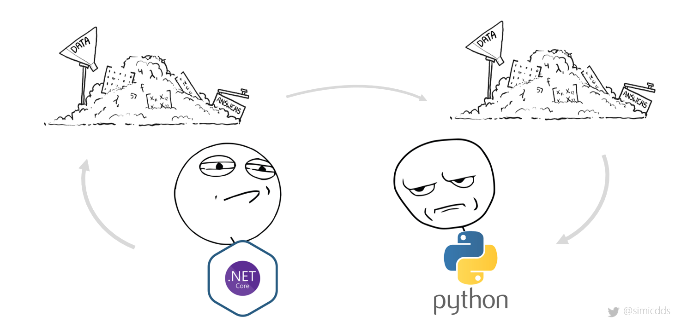
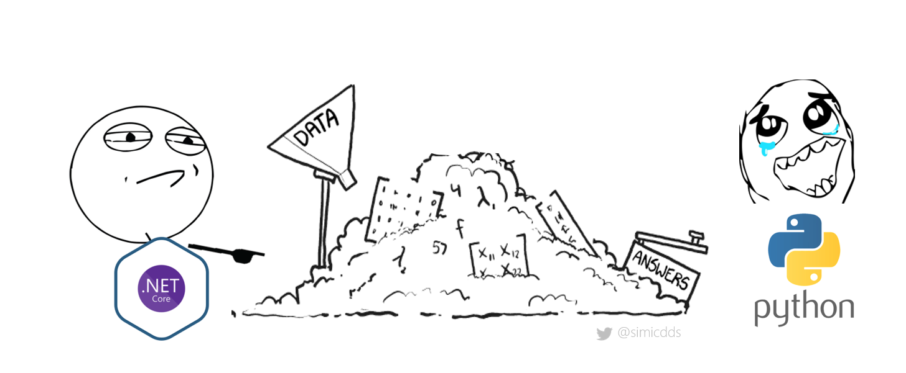
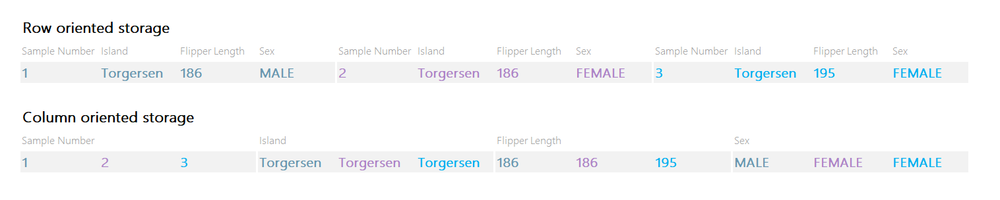
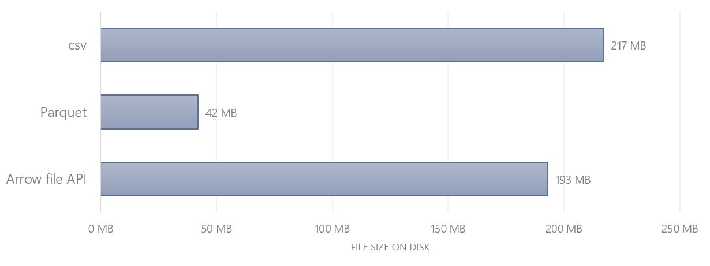
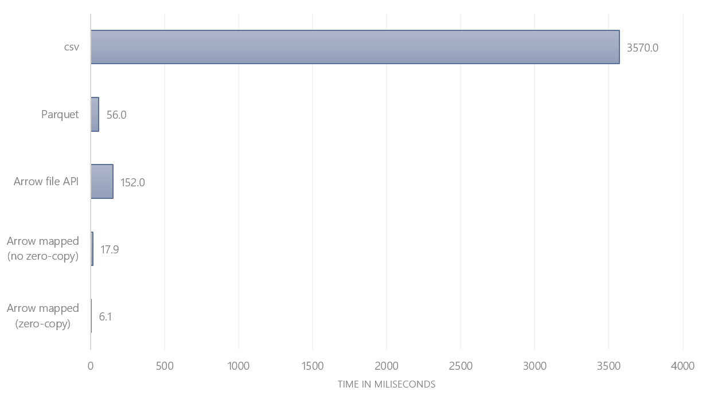
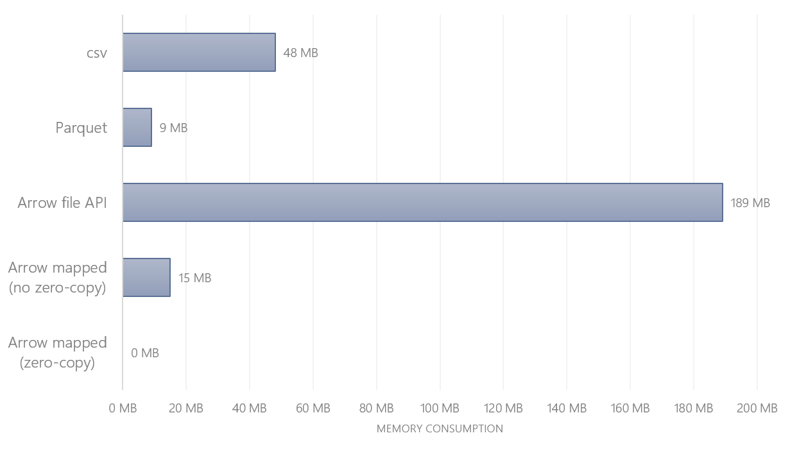

# Apache Arrow: Read DataFrame With Zero Memory

# Theoretical & practical introduction to Arrow file format

Last week I saw a tweet from Wes McKinney, probably best known as the creator of the awesome pandas package:

[https://twitter.com/wesmckinn/status/1272641133168992256?s=20](https://twitter.com/wesmckinn/status/1272641133168992256?s=20)

So, when I saw him quoting William Gibson, I thought there must be something amazing going on. I was not disappointed.

The tweet at the start of the chain was about [Hugging Face](https://github.com/huggingface/nlp), a natural-language processing library. The project collects datasets that can be used for training & benchmarking of models. And some of these datasets are huge. In the initial tweet, [Thomas Wolf](https://twitter.com/Thom_Wolf) points out that with a special file format, he and [Quentin Lhoest](https://twitter.com/qlhoest) are now able to iterate through 17GB of data in less than a minute with a RAM footprint of 9MB 🤯

[https://twitter.com/Thom_Wolf/status/1272512974935203841?s=20](https://twitter.com/Thom_Wolf/status/1272512974935203841?s=20)

The first question that came to my mind: How? What magic is going on here?

So that was the future Wes McKinney was talking about.

Since there aren’t many practical examples online, I decided to write an introductory blog post with hands-on example about what I’ve learned so far. I’m not affiliated with the Hugging Face or PyArrow project. At the end of this article, you will find links to all sources.

> *Any sufficiently advanced technology is indistinguishable from magic.* 
— Arthur C. Clarke, 3rd law

<figure>
  
  <figcaption>Photo by <a href="https://unsplash.com/@sortino?utm_source=medium&utm_medium=referral">Joshua Sortino</a> on <a href="https://unsplash.com/?utm_source=medium&utm_medium=referral">Unsplash</a></figcaption>
</figure>


## Exchanging data smoothly

The first clue was [Thomas Wolf referring to Apache Arrow](https://twitter.com/Thom_Wolf/status/1272526359299047424?s=20). Apache Arrow is a project started by Wes McKinney, intending to create an interface for data exchange:

> Apache Arrow is a cross-language development platform for in-memory data. It specifies a standardized language-independent columnar memory format for flat and hierarchical data, organized for efficient analytic operations on modern hardware. It also provides computational libraries and zero-copy streaming messaging and interprocess communication. [1]

**What does this mean?**

Before Arrow, the standard way of exchanging data between any application or library was to store it to disk in one way or the other. So if a .NET Core library wants to pass the data to Python for data analysis, chances were that someone would write out a file (e.g. csv, json, Parquet, …) and then read it in again with Python. Both steps, the writing (serialization) and reading (deserialization) are costly and slow — and the bigger the dataset, the longer it takes to complete each of them.

<figure>
  
</figure>


What if there was a way to exchange the data directly via handshake and zero copying? It could look like this: .NET would start chatting with Python, point to a pile of data in memory and be like: *Hey pal, this is yours now*. And Python could directly jump onto it without carting it from one place to another. Wouldn’t that be fantastic?

That’s what Apache Arrow is all about.

<figure>
  
</figure>

### Is Parquet the secret?

That left me wondering — how can I use Arrow? By looking at the source code of Hugging Face, I learned that the project uses [PyArrow](https://arrow.apache.org/docs/python/) to read the data. Until then, I associated PyArrow with Parquet, a highly compressed, columnar storage format. So, is Parquet the way how Arrow exchanges data? (Spoiler: It’s not)

Traditionally, data is stored on disk in a row-by-row manner. Columnar storage was born out of the necessity to analyze large datasets and aggregate them efficiently. Data analytics is less interested in rows of data (e.g. one customer transaction, one call log, …) but on aggregations thereof (e.g. total amount spent by customer, total call minutes by region, …).

<figure>
  
  <figcaption>Row vs column oriented storage (Adapted from [4] with <a href="https://github.com/allisonhorst/palmerpenguins">Palmer Station Penguin dataset</a>)</figcaption>
</figure>


This gave rise to changing the orientation: Instead of storing it row by row, columnar storage arranges data column by column.

Parquet is a columnar file format which has two major benefits [4]:

1. **Highly compressible:** While .json or .csv files are by default uncompressed, Parquet compresses data and hence saves a lot of disk space. Tables have usually a mix of columns with large number of unique values (high cardinality; think of unique *user ID*) and columns with only few unique values (low cardinality; think of *country*). The lower the cardinality, the better compression (may) work — more on that in the next section
2. **File querying/filter pushdown:** Prune unnecessary data before reading it in. This improves loading times and optimizes resource consumption. If you only need two columns from a thousand-column table, you don’t need to scan all rows to get the two attributes — you directly fetch the column in its entirety

## Compression

To better understand the difference between Parquet and Arrow, we will need to make a detour and get some intuition for compression. File compression is a huge subject on its own right. The following is a simplified narrative, filtered through my own understanding of the topic. This digression will help answer these two questions:

- How does Parquet get file down to such small sizes?
- Where does Parquet differ from Arrow?

### Flip the coin

Imagine you flip a coin ten times and record the result:

```
[Head, Head, Head, Head, Tail, Tail, Tail, Head, Tail, Tail]
```

Now, try to say the result out loud? Likely, you’ll shorten it and say something like *“4 times head, 3 times tail, head and 2 times tail”*:

```
[4 x Head, 3 x Tail, Head, 2 x Tail]
```

That’s compression in action (the described algorithm is called *Run-length encoding* [8]). We tend to naturally see a pattern and abbreviate. A compression algorithm does that too — just with more raw computational power and sophisticated rules. But this example should be sufficient to help us understand a key difference: While .csv takes the literal approach and spells out each single record, Parquet abbreviates (without losing any information).

This simple example is sufficient to also get an intuition on why the compression ratio can widely differ. For instance, if the sort order doesn’t matter and you are simply interested in the total occurrence count of head vs tail, you could sort the list first and then the compressed version would look like this:

```
[5 x Head, 5 x Tail]
```

By implication, if we sort a dataset by all columns first before we save it to Parquet, the file size will be smaller compared to an unsorted one. The compression ratio will be higher the lower the cardinality. The compression ratio for each column is expected to shrink the further down it is in the sort order.

### Is Arrow compressed?

With this, we gained some intuition of why Parquet files are so small compared to uncompressed .csv files. But how is that related to Arrow?

It turns out that this is exactly one of the key differences. Parquet is stored in a highly efficient way on disk. And with filter pushdown you can reduce the volume of data read in (i.e. by selecting only the columns you actually need). But when you want to perform operations on the data, your computer still needs to unpack the compressed information and bring it into memory. [2]

Arrow on the other hand is a *memory-mapped* format. In a blog-post Wes McKinney summarizes it as following:

> “Arrow serialization design provides a ‘data header’ which describes the exact locations and sizes of all the memory buffers for all the columns in a table. This means you can memory map huge, bigger-than-RAM datasets and evaluate pandas-style algorithms on them in-place without loading them into memory like you have to with pandas now. You could read 1 megabyte from the middle of a 1 terabyte table, and you only pay the cost of performing those random reads totalling 1 megabyte.” [6]

In short, applications can directly operate on a dataset stored on disk without the need to fully load it into memory. If you recall the initial Tweet — that’s exactly what was going on there.

## Hands-on: Performance comparison

Now let’s explore these data formats. As a sample dataset I’m using the [Palmer Station Penguin dataset](https://github.com/allisonhorst/palmerpenguins). Since it only contains 350 rows, I’ll resample it to 1 million so that the performance difference becomes more apparent:

[https://gist.github.com/simicd/fda4d5a4ebcd485a7d66c94d8ecaa013](https://gist.github.com/simicd/fda4d5a4ebcd485a7d66c94d8ecaa013)

### Writing the files

As a next step I write the files to disk in three formats:

- csv (DataFrame with missing values)
- Parquet (DataFrame with missing values)
- Arrow (DataFrame with & without missing values)

Note that Arrow can only be converted to pandas without allocating memory (= zero-copy) under certain conditions. One of them: There must be no NaN values. To compare the performance between with & without zero-copying, I write the Arrow file once with and without missing numeric values.

[https://gist.github.com/simicd/98cccac6b87a393646d5ce200252edcc](https://gist.github.com/simicd/98cccac6b87a393646d5ce200252edcc)

The resulting file sizes are:

<figure>
  
  <figcaption>File size comparison</figcaption>
</figure>


Parquet is as expected the smallest file — despite the random sequence (no sorting took place before writing the file out), it shines with a compression ratio of 80%. Arrow is only slightly smaller than csv. Reason is that csv stores even numeric values as strings which consumes more disk space. In all cases the size difference between files with missing values and without is insignificant (<0.5 MB).

### Reading time

Now the key part: Reading performance. How long does it take to calculate average flipper length?

- csv
- Parquet
- Arrow with file API (`OSFile(...)`)
- Arrow as memory-map API (`memory_map(...)`) with missing values/NaN
- Arrow as memory-map API (`memory_map(...)`) without missing values

[https://gist.github.com/simicd/72815e7f639502d35047541c80773d8a](https://gist.github.com/simicd/72815e7f639502d35047541c80773d8a)

Timing each of the three functions, the following results arise:

<figure>
  
  <figcaption>Performance comparison: Time required to read column & calculate average</figcaption>
</figure>


Unsurprisingly, csv is the slowest option. It requires reading 200MB, parse the text, discard all columns except flipper length and then calculate the mean.

Parquet is ~60 times faster since there is no need to parse the entire file — only the required columns is read in.

Arrow with missing values is ~3 times faster than Parquet and almost ~200 times faster than csv. Like Parquet, Arrow can limit itself to reading only the specified column. What makes it faster is that there is no need to decompress the column.

Note that the difference between reading memory-mapped Arrow files with and without zero-copying meant another ~3 times performance improvement (i.e. zero-copy is in total ~600 times faster than csv and ~9 times faster than Parquet).

What’s surprising: Arrow with the file API is even slower than Parquet. What’s going on?

### Memory consumption

To answer that let’s look at the memory consumption. How much RAM is each file consuming if we read a single column?

[https://gist.github.com/simicd/d700b557be69127fb57d7d81dd405c75](https://gist.github.com/simicd/d700b557be69127fb57d7d81dd405c75)

Here are the results:

<figure>
  
  <figcaption>Performance comparison: Memory consumed to read column</figcaption>
</figure>


Most notable: Arrow with file API consumes 189 MB — which is pretty much the entire file size (even though we only read a single column?!). The answer lies in the [documentation](https://arrow.apache.org/docs/python/memory.html#on-disk-and-memory-mapped-files):

> “[…] OSFile allocates new memory on each read, like Python file objects.” [3]

By using `OSFile` the entire file was read into memory first. Now it's obvious why this operation was slower than Parquet and consumes the most memory!

However, by using the memory-mapping function and with filled NaN values, the pandas DataFrame was created directly on top of the stored Arrow file. No copying: 0 MB of RAM! No surprise this was the fastest option.

You can find the entire [Jupyter Notebook here](https://gist.github.com/simicd/f0e8fcd277bb3fa932369551b97d5b07) 📝

## Conclusion

For me, there is lot to learn about Arrow. What I have learnt so far is: You can’t have your cake and eat it, too. There is a trade-off between [7]:

- Optimize for disk space/long-term storage on disk → Parquet
- Optimize for data exchange and fast retrieval → Arrow

The performance gains of both Parquet and Arrow are significant compared to csv. When storing Arrow to disk, it consumes more storage than Parquet. However, Arrow beats Parquet in terms of reading performance — both in terms of time and memory consumption. The presented examples (calculate mean of one column/read column) are only scratching on the surface — my expectation is that with more complicated queries & bigger datasets Arrow would shine even more.

As long as Arrow is read with the memory-mapping function, the reading performance is incredible. The best case is when the dataset has no missing values/NaNs. Then PyArrow can do its magic and allow you to operate on the table, barely consuming any memory.

The future is indeed already here — and it’s amazing!

## Follow me on Twitter

I will keep writing about Python, data and technology —I’d be happy to [meet you on Twitter](https://twitter.com/simicdds) ✨

Big thanks to [Yingying](https://medium.com/u/60eee1ec293a) for the thorough review and great feedback! 👏

## Sources

[1] Apache Arrow, [Landing Page](https://arrow.apache.org/) (2020), Apache Arrow Website

[2] Apache Arrow, [FAQ](https://arrow.apache.org/faq/) (2020), Apache Arrow Website

[3] Apache Arrow, [On-Disk and Memory Mapped Files](https://arrow.apache.org/docs/python/memory.html#on-disk-and-memory-mapped-files) (2020), Apache Arrow Python Bindings Documentation

[4] J. LeDem, [Apache Arrow and Apache Parquet: Why We Needed Different Projects for Columnar Data, On Disk and In-Memory](https://www.kdnuggets.com/2017/02/apache-arrow-parquet-columnar-data.html) (2017), KDnuggets

[5] J. LeDem, [The Columnar Roadmap: Apache Parquet and Apache Arrow](https://www.dremio.com/webinars/columnar-roadmap-apache-parquet-and-arrow/) (2017), Dremio

[6] W. McKinney, [Apache Arrow and the “10 Things I Hate About pandas”](https://wesmckinney.com/blog/apache-arrow-pandas-internals/) (2017), Blog

[7] W. McKinney, [Some comments to Daniel Abadi’s blog about Apache Arrow](https://wesmckinney.com/blog/arrow-columnar-abadi/) (2017), Blog

[8] Wikipedia, [Run-length encoding](https://en.m.wikipedia.org/wiki/Run-length_encoding) (2020), Wikipedia