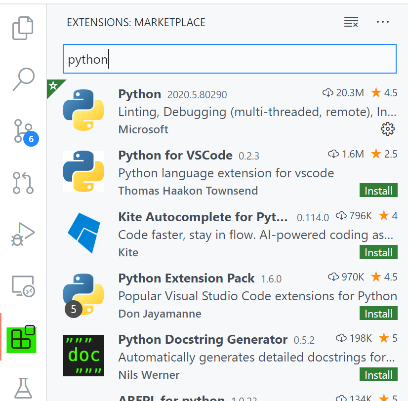
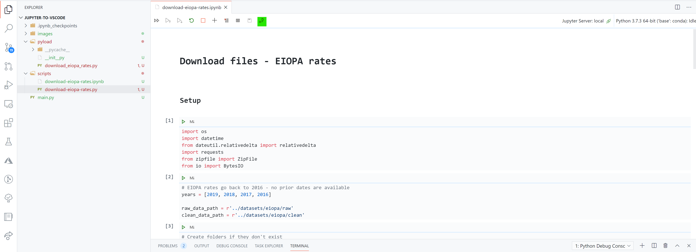
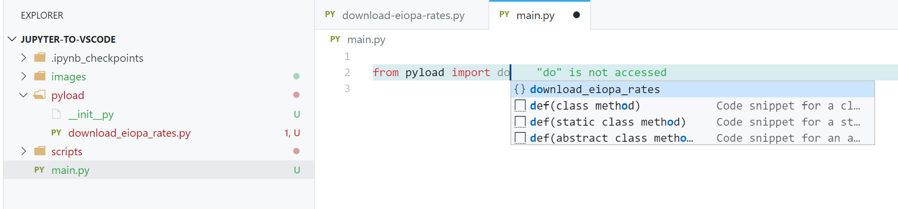
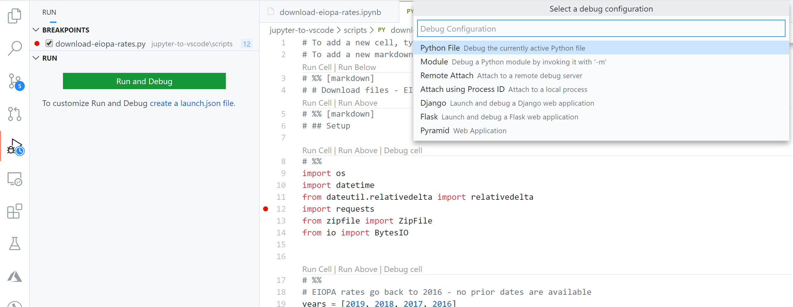
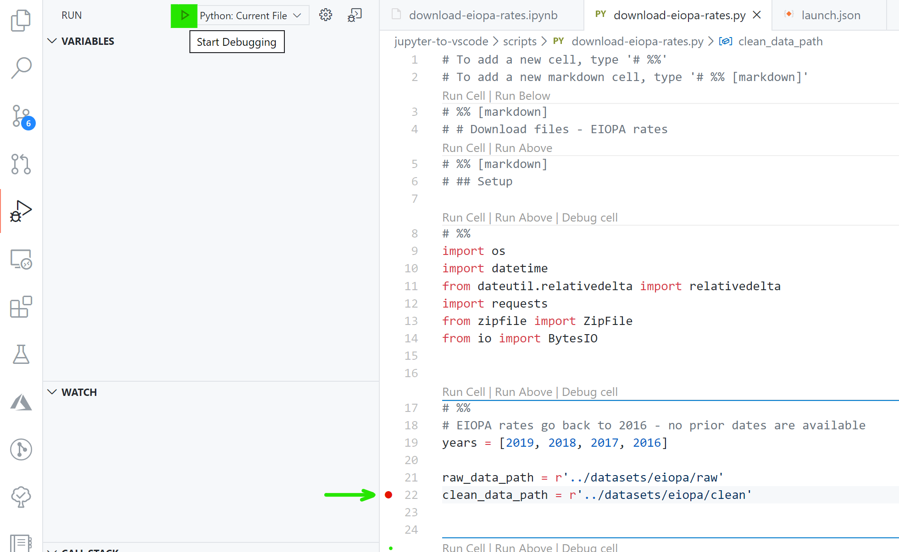
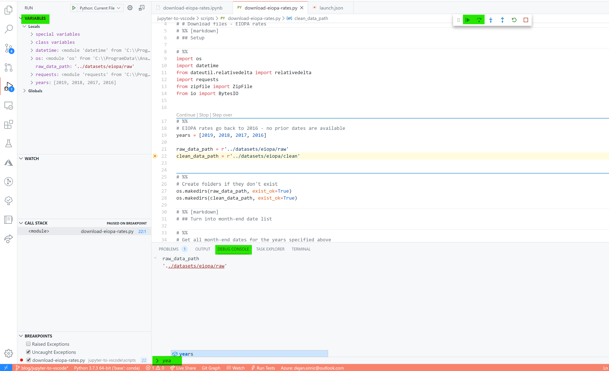

# How to create your first Python package from Jupyter Notebook
I started writing Python a bit more than two years ago. [Jupyter Notebooks](https://jupyterlab.readthedocs.io/en/stable/) and [Anaconda](https://www.anaconda.com/products/individual) helped me tremendously with getting started with Python: Easy to set up, immediate visual feedback when executing code cells, lots of pre-installed packages. For rapid prototyping there are few tools better suited than Jupyter.

### Problems, … problems everywhere 
However, with time, as I wrote larger applications and my colleagues started writing Python, too, we ran into several problems:
- **Reusing code: How to share code across notebooks?** Code written in one Jupyter Notebook is bound to that one workbook. And notebooks are organized in a linear fashion (top-down), which makes it difficult to organize large projects.
- **Tracking changes: How to highlight modifications and efficiently keep track of different versions of the application?** With Jupyter Notebooks the native way is to copy and paste the .ipynb files, which is not handy when working with colleagues on the same project.
- **Collaborating: How to collaborate on the same code base?** As the team size grows, people will work on new features simultaneously. Manually reconciling different Notebooks and figuring out what has been changed in which section becomes a nightmare very quickly.
- **Ensuring quality: How to prevent bugs (or at least: catch them early on)?** With a project growing (in terms of size or importance) it is impossible to manually check the outputs after every single change. This becomes a problem because any change can make the entire application break.


---

In short, developing in Jupyter Notebooks reached its limits for me and something new was required to resolve the problems. The good thing is that for all the problems above, there are well-proven solutions. Professional developers use these tools and techniques for years:
- **Reusing code** → Create library, break into modules, classes, and functions
- **Tracking changes** → Version control with Git
- **Collaborating** → Share codebase on remote repository using GitHub
- **Ensuring quality** → Write tests that can be run after every change

In this and a series of future blog posts I will enter each of these topics individually. Version control and automated testing will be key towards a maintainable codebase.


---

## Goal ⭐️
The topic of this post is the first step on the journey towards solving the problems. We will start by installing the necessary tools. We will lay the foundation by creating a Python package so that your code can be reused across applications and notebooks.


## Basics
### What is a package? 📦
Like many other programming languages, Python offers the possibility to isolate code so that it can be called from many places. Definitions:
- Package: Collection of sub-packages or modules
- Module: Single .py file containing code

Let's take pandas as an example. When importing pandas you are using a package:
```python
import pandas as pd
pd.read_csv(...)
```

Behind the scenes, the package is organized in a folder structure - there is a package folder (called `pandas`) with an `__init__.py` file and one or several modules (e.g. `read_dataframe.py` which contains the `read_csv(...)` function):
```
pandas/
  __init__.py
  ...
  read_dataframe.py
  ...
```

In reality, the pandas folder structure above is vastly simplified but is sufficient to highlight the following: A Python package is easy to create and you can fairly quickly turn your notebook into a package.

Of course, there are additional aspects that will be required for distributing a package - more on that in a future post. For more information about Python packages, see here.


## Steps
### Step one: Install the tools 💻
*Why a new tool?* you might wonder - *I have already Jupyter!*
Jupyter is great for exploratory analysis but for advanced code development it has little to offer. To bring your Python applications to a new level, a code editor is required. The tools and extensions that come with it will make many of the burdens disappear.

**Visual Studio Code** (or short: VS Code) provides intelligent code completion for many languages, simplifies code refactoring, and embeds version control (Git). It is highly customizable to adapt to your personal preferences. VS Code is the [most popular developer environment tool](https://insights.stackoverflow.com/survey/2019#technology-_-most-popular-development-environments) - and the best of all, it's free and open-source. 
VS Code only offers basic editor functionality out of the box. Language support, themes, but also code snippets can be added through extensions. This helps to keep the tool lean and allows you to tailor it to your needs.
To set it up:
- Download and [install VS Code](https://code.visualstudio.com/)
- Install the Python extension - Once you start VS Code go to the Extensions menu (highlighted below), search for Python, and install Microsoft's extension. There are thousands and thousands of extensions -definitely go and explore them!

  

**Git** is a version control tool that works nicely together with VS Code. It keeps track of files and registers changes so that you can always go back, without manual copy-pasting of backup versions. It even allows you to have different versions of a file at the same time and it can merge them together eventually.
- Download and [install Git](https://git-scm.com/downloads)

**Anaconda** (in case you don't have it already - optional) is a Python installation that comes with dozens of the most popular Python packages.
- Download and [install Anaconda](https://www.anaconda.com/products/individual)


---

If you have installed everything successfully you should be able to 
1. Start Visual Studio Code (VS Code ✔️)
1. Initialize a new repository from the Source Control menu in the VS Code sidebar (git ✔️)
1. Choose a Python version in VS Code (requires at least one .py file to be opened since VS Code only load extensions when required) (Anaconda ✔️)

In case you have issues don't hesitate to leave a comment below or send me a [message on Twitter](https://twitter.com/simicdds) 🔈

With these applications installed, you are ready to go.


### Step two: Create your first Python package (it's a folder, really 📁)
As mentioned in the Basics section above, Python makes it super easy to create your own package.
1. Create a project folder (my root folder is typically `C:\Users\[username]\source\repos\[projectName])` and *within* that your package folder - the package folder name will be your package name (e.g. `pyload`)
1. An empty file called `__init__.py`
1. Any number of modules, i.e. `.py` files with your code (more on that in step three below)
1. A `main.py` file - this will be our inception point when we call the package later

```
projectName/
  pyload/
     __init__.py
     download_eiopa_rates.py
     ...
  main.py
```

### Step three: Turn your Jupyter Notebook into a .py file 📜
Luckily, VS Code provides a convenient way to turn your notebook into a Python module. I will use a script I have written which downloads a bunch of files and unzips them. (TODO: UPLOAD/SHARE SCRIPT)

1. Open your notebook (.ipynb file) in VS Code by copying it somewhere into your project folder (in my case `scripts/download-eiopa-rates.ipynb`) and then clicking on the `.ipynb`. VS Code will open the built-in notebook view:
   
2. Select *Convert and save to a python script* (highlighted in green above) 
3. Save the file in the `pyload` package folder with a `.py` ending - note that Python modules must not contain any special characters other than underscore and must start with a letter.


And that's it! You can validate if it worked out by opening the `main.py` file and trying to import the module. If the package is set up correctly, VS Code will automatically suggest the right name:

   

### Step four: Run your package with VS Code 🚀
Now that we have set up the basic package structure, it's time to run the code. One big difference between Jupyter and VS Code is that VS Code has a debugger. This means that you can stop the code in any given line and inspect it.

1. Go to the debug/run menu in the sidebar and select *create a launch.json file* (only required for the very first time) and then select *Python File* from the dropdown.
   
2. You can set so-called breakpoints (red dot) by clicking to the left of the line number. This will tell the debugger to stop and wait there. You can start the execution with F5 or by clicking on the start button:
   
3. The debugger will stop at your breakpoint. You can continue execution (first button on the top right) or line by line (second button). While at the breakpoint you can inspect variables (top left) or write code in the Debug Console (bottom).
    

If everything went well, your code will run until the end and produce the same outputs as with the Jupyter notebook!


## Summary
### From Jupyter Notebook to Python package
1. Install VS Code with Python extension, Git and Anaconda
1. Create a folder with an empty file called `__init__.py`
1. Open your Jupyter Notebook in VS Code and store your code as `.py` file in the package folder
1. Set up and call your package in `main.py` using the VS Code debugger


## Next steps ⭐️
Now we still have the entire codebase in one large module. In the next step we will write functions and turn the module into smaller chunks.


## Follow me on Twitter 
In the future, I will post more about Python and VS Code - if you liked the post [follow me on Twitter](https://twitter.com/simicdds) ✨


Big thanks to [Yingying Fu](https://medium.com/@yingying.fu726) for reviewing my first blog post on Medium! 👏
